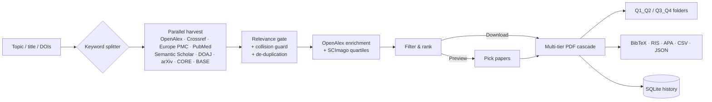

# 📚 Articles Downloader

<div align="center">

[](https://github.com/Kamran5H/ArticlesDownloader/actions/workflows/ci.yml)
[](LICENSE)
[](#-installation)
[](#-scholarly-sources)

**Search 9 scholarly databases at once, rank papers by SCImago journal quartile, download the open-access PDFs, and get ready-to-import citations: all from a local desktop app.**

[Features](#-features) · [Install](#-installation) · [Use it](#-usage) · [CLI](#-command-line-reference) · [Outputs](#-what-you-get) · [How it works](#-how-it-works) · [Development](#-development)

</div>

---

## ✨ Features

| | |
| --- | --- |
| 🔎 **Parallel federated search** | Queries up to 9 sources simultaneously; pick which ones in *Advanced options* or with `--sources`. |
| 🎯 **Relevance gate** | Title + abstract matching with a configurable minimum (default 60%), chemistry/acronym awareness (LATP, ZAB, Li, Zn…), and a *discipline-collision guard* that stops e.g. urology “LATP” papers polluting battery searches. Errata, corrections and meeting abstracts are dropped. |
| 🏆 **Journal quality ranking** | Every paper is matched to the bundled SCImago table (ISSN, title and abbreviations such as *Adv. Energy Mater.*) and badged Q1–Q4. Filter to Q1–Q2, Q1–Q4 or everything. |
| 👀 **Preview before download** | Rank the candidates first, tick exactly the papers you want, then download them. |
| #️⃣ **DOI list mode** | Paste any list of DOIs or doi.org links and download those exact papers with full metadata. |
| ⬇️ **Multi-tier PDF retrieval** | Publisher direct-PDF patterns → harvested open-access links → Unpaywall → landing-page scraper. 12 parallel workers, per-keyword balancing for long titles. |
| 📝 **Citations** | `references.bib`, `references.ris` (Zotero/EndNote/Mendeley), APA 7, Excel-ready CSV and a JSON corpus, plus one-click copy of APA/BibTeX for any paper. |
| 🗂 **History** | A local SQLite history powers *incremental mode* (skip what you already have) and a searchable History tab where you can reopen PDFs, re-run a topic or forget it. |
| 🖥 **Modern local UI** | Light/dark themes, live progress, sortable/filterable results, paper details with abstracts, live console, keyboard shortcuts. A classic Tkinter GUI and a headless CLI are also included. |

## 🔍 Scholarly sources

| Key | Source | Coverage | Notes |
| --- | --- | --- | --- |
| `openalex` | OpenAlex | 250 M+ works, all fields | abstracts, concepts, OA locations |
| `crossref` | Crossref | 150 M+ DOIs | bibliographic matching |
| `europepmc` | Europe PMC | life sciences, full-text OA | direct PMC PDFs |
| `pubmed` | PubMed Central (NCBI E-utilities) | biomedical & materials | |
| `semanticscholar` | Semantic Scholar | multidisciplinary, AI-indexed | optional `S2_API_KEY` raises rate limits |
| `doaj` | DOAJ | open-access journals | |
| `arxiv` | arXiv | physics, CS, maths, q-bio preprints | |
| `core` | CORE | open repositories | needs a free `CORE_API_KEY` |
| `base` | BASE (Bielefeld) | academic repositories | only answers IP-whitelisted clients |

No keys are needed for the default sources. Metadata requests identify themselves with a contact e-mail so they land in the APIs’ polite pools. Set yours with `ARTICLES_CONTACT_EMAIL` or `--email`.

## 📦 Installation

Requires **Python 3.10+**.

```bash
git clone https://github.com/Kamran5H/ArticlesDownloader.git
cd ArticlesDownloader

python -m venv .venv
# Windows:  .venv\Scripts\activate
# macOS/Linux:
source .venv/bin/activate

pip install -r requirements.txt
```

`curl_cffi` (in `requirements.txt`) is optional. It uses browser-grade TLS fingerprints, which get fewer publisher download blocks. If it fails to install on your platform, the app falls back to `requests`.

## 🚀 Usage

### Desktop app (default)

```bash
python Articles_v2.py
```

This starts a server on `127.0.0.1` and opens the app in a chromeless Edge/Chrome window, or your browser if neither is found. On Windows you can double-click **`run_articles.vbs`** to launch it without a console window. Startup errors go to `launch.log`.

1. Type a topic or a full paper title (long titles are split into keyword groups automatically).
2. Optionally add a **Focus**, pick years, the number of PDFs, the journal quality and the ranking.
3. Press **Search & download**, or **Preview** to review the ranked list and download only the papers you tick.
4. Click any paper for its abstract, DOI and one-click citations; use **Export** for BibTeX/RIS/APA/CSV/JSON.

Keyboard: <kbd>Ctrl</kbd>+<kbd>Enter</kbd> start · <kbd>/</kbd> filter papers · <kbd>Esc</kbd> close details.

Other interfaces: `python Articles_v2.py --web` opens a normal browser tab, and `--tk` opens the classic Tkinter GUI.

### Command line

```bash
# Download the 25 best-ranked PDFs on a topic
python Articles_v2.py -k "zinc air battery electrocatalyst" -m 25 -o ./pdfs

# Topic + focus, only Q1/Q2 journals, newest first, from selected sources
python Articles_v2.py -k "LATP" -f "solid electrolyte" -q q1_q2 -s newest --sources openalex,crossref,arxiv

# Just list the ranked candidates, download nothing
python Articles_v2.py -k "perovskite solar cell stability" --preview -m 30

# Exact papers by DOI (repeat --doi, or use a file with DOIs in any layout)
python Articles_v2.py --doi 10.1038/s41586-020-2649-2 --doi 10.3390/ma14010001
python Articles_v2.py --doi-file my_dois.txt -o ./pdfs

# Only fetch papers you have not downloaded for this topic before
python Articles_v2.py -k "zinc air battery" --mode incremental

python Articles_v2.py --history        # past topics
python Articles_v2.py --list-sources   # source keys
```

## 🧾 Command-line reference

| Option | Default | Description |
| --- | --- | --- |
| `-k, --keywords, --query` | — | Topic or long paper title |
| `-f, --focus` | — | Sub-focus / methodology |
| `-y1, --start-year` / `-y2, --end-year` | last 3 years | Publication year range |
| `-m, --max` | 50 | Number of PDFs (1–500) |
| `-q, --quartiles` | `all_ranked` | `q1_q2`, `all_ranked` (Q1–Q4) or `all` (incl. preprints/unranked) |
| `-s, --sort` | `quartile_cits` | `quartile_cits`, `citations`, `newest`, `relevance` |
| `-r, --min-relevance` | 0.60 | Minimum relevance match, 0–1 |
| `--sources` | all | Comma-separated source keys |
| `--mode` | `fresh` | `incremental` skips papers already in history for the topic |
| `--preview` | off | Rank only; print the list; download nothing |
| `--doi`, `--doi-file` | — | Download specific DOIs |
| `-o, --folder` | `D:\Research_PDFs` if a D: drive exists, else `~/Downloads/Research_PDFs` | Output folder |
| `--email` | — | Contact e-mail for API polite pools |
| `--allow-scihub` | off | Enable the Sci-Hub fallback (see note below) |
| `--cli` / `--tk` / `--web` | — | Force headless / Tkinter / browser-tab mode |
| `--port`, `--no-browser` | 5080 | Local server port; start without opening a window |

**Environment variables:** `ARTICLES_CONTACT_EMAIL`, `S2_API_KEY`, `CORE_API_KEY`, `ARTICLES_ALLOW_SCIHUB=1`.

## 📁 What you get

```text
<output folder>/
├── Q1_Q2/                      # PDFs from Q1 and Q2 journals
├── Q3_Q4/                      # Q3/Q4, preprints and unranked
├── references.bib              # BibTeX (LaTeX-escaped, unique keys)
├── references.ris              # RIS for Zotero / EndNote / Mendeley
├── references_APA.txt          # APA 7th edition
├── results.csv                 # Excel-friendly (UTF-8 BOM): quartile, match %, citations, DOI, file…
├── corpus_metadata.json        # machine-readable metadata incl. abstracts & concepts
└── research_download.log       # full run log
```

## 🏗 How it works



## 🔒 Privacy & safety

- Everything runs on your computer. The web UI listens on `127.0.0.1` only and rejects requests from other hosts and websites (Host/Origin checks, JSON-only state changes, no CORS). It serves and opens files only from your download folders.
- TLS certificates are verified. Verification is skipped only for a host whose certificate chain is broken, and each skip is logged.
- **Sci-Hub fallback is off by default.** Using it may infringe copyright in your country or break your institution’s rules; enable it (`--allow-scihub` or *Advanced options*) only if you are sure it is permitted for you.

## 🧪 Development

```bash
pip install -r requirements-dev.txt
python -m pytest                                    # offline: unit, workflow and web API tests
ruff check --select E9,F,B --ignore B008,B905 Articles_v2.py tests
```

The test suite needs no network: sources and PDF servers are replaced by in-memory fakes. CI runs it on Python 3.10–3.13 (Ubuntu) and 3.12 (Windows).

```text
ArticlesDownloader/
├── Articles_v2.py        # engine, web server, Tkinter GUI and CLI
├── articles_ui.html      # web user interface (served locally)
├── scimago_ranks.csv     # SCImago journal ranks (ISSN, title, quartile)
├── run_articles.vbs      # silent Windows launcher
├── articles.ico          # app icon
├── tests/                # pytest suite
├── extras/               # unrelated helper scripts kept for reference
└── requirements*.txt
```

To refresh journal ranks, download the latest SCImago export (`scimagojr.com → Journal Rankings → Download data`) and replace `scimago_ranks.csv`.

## 📜 License

[MIT](LICENSE) © 2024-2026 **Kamran Ashraf**
